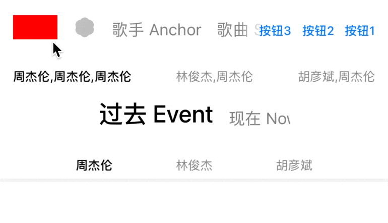

# Segmenter



## 用法

```swift
let segmenter = Segmenter()

// 是否需要显示阴影
segmenter.isShadowShouldShow = false
// 附加视图的间距
segmenter.supplementaryVerticallyOffset = 5

// 样式, 有 3 种： default, centered, evened, aroundEvent
// 见：+Distribution.swift -> enum Distribution: Int
segmenter.distribution = .default

// segment 点击委托
segmenter.delegate = self

// 配置视图
segmenter.segments = [
    // 显示 view, activeSize 选中时的大小，inactiveSize: 未选中大小
    Segment(view: UIView(), activeSize: CGSize.zero, inactiveSize: CGSize.zero),
    
    // 显示 image 
    Segment(image: UIImage(), activeSize: CGSize.zero, inactiveSize: CGSize.zero)
    
    // 显示 label, 可配置文本字体大小
    Segment(title: "Label")
    // 完整的 title 初始化
    // Segment(title: "Label", supplementaryViews: [SupplementView], shadowHidden: false, activeFont: UIFont, activeColor: UIColor, inactiveFont: UIFont, inactiveColor: UIColor)
    
    // 显示自定义的 View, 自定义 View 需要实现 SegmentView 协议 (UIControl + SegmentViewProvider)
    // 每个 View 对应一个 SegmentInfoProvider
    // 实现 SegmentInfoProvider 后, 传入 SegmentInfoProvider 协议即可
    // 可参考 +Segment+Image.swift / +Segment+Label.swift / +Segment+View.swift
    Segment(custom: SegmentInfoProvider)
]

// Indicator, 下标
segmenter.indicator = LineIndicator()
```


## Demo

Download the project and then open `Demo/Segmenter.xcodeproj`


## Features

· 背景透明时也支持阴影效果

· SupplementaryView 支持独立控制，且同一个 view 只需初始化一次即可出现在任意 Segment 中

· 背景视图使用 backgroundView 设置，已为其添加 gradientLayer 属性，支持渐变色

· Segment 支持自定义 View

· segments 长度超出范围时可滚动显示，对 SupplementaryView 做了优化/适配

· 支持全局配置默认属性，可被实例自定义配置覆盖

```swift
// 参考
public static var `default` = Appearance()
```


## Installation

#### Swift Package Manager
`.package(url: https://github.com/iWECon/Segmenter", from: "2.1.0")`
